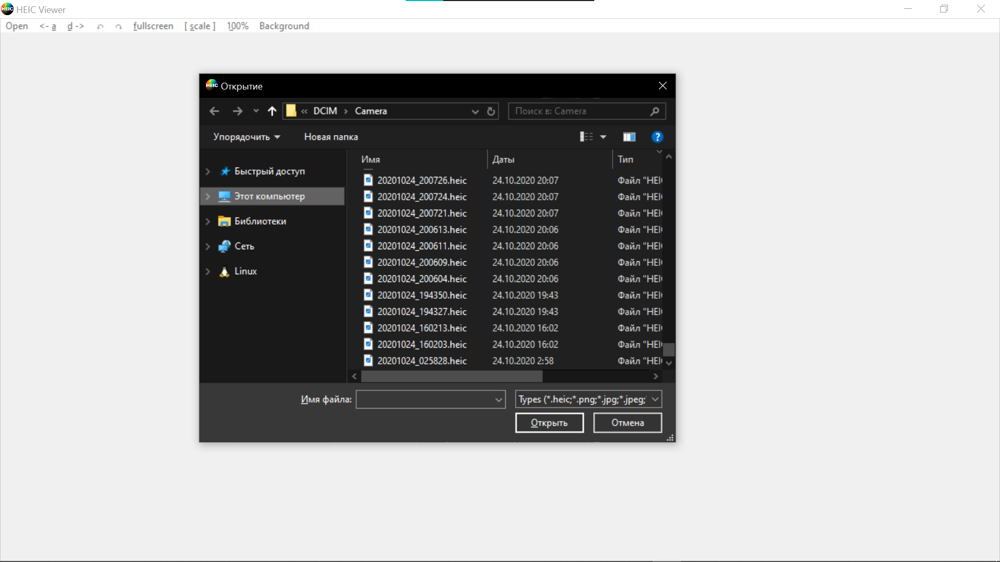
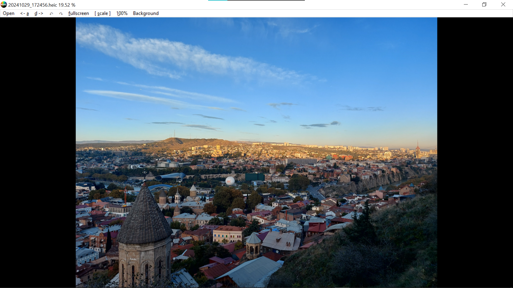
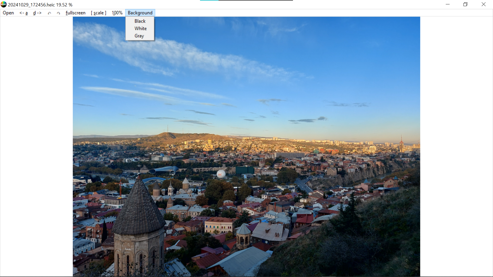
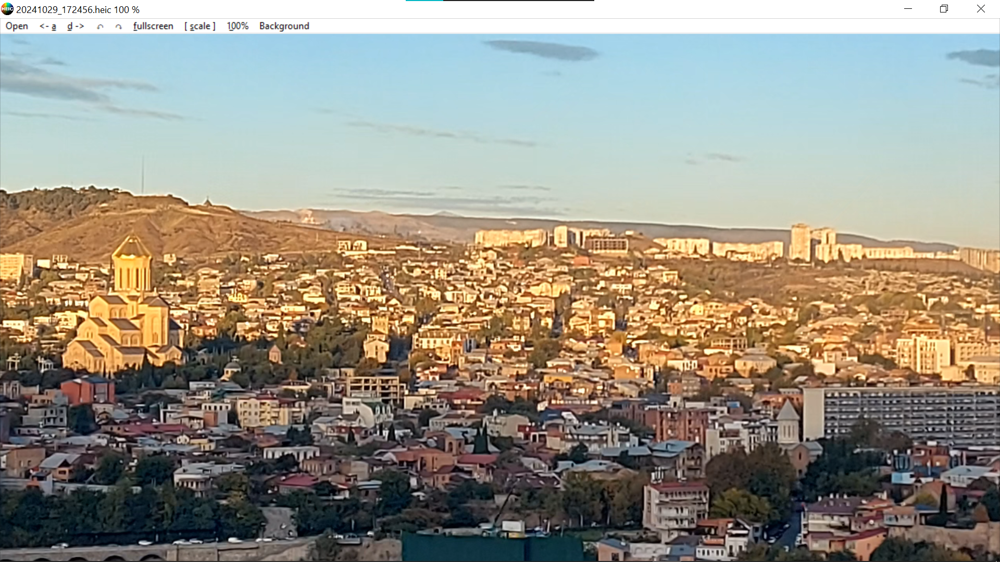

# HEIC Viewer

This is portable desktop app for viewer images with which you can also view heic files.

* File dialog window  

* Heic image  

* Change background color  

* Zoom demonstration  
